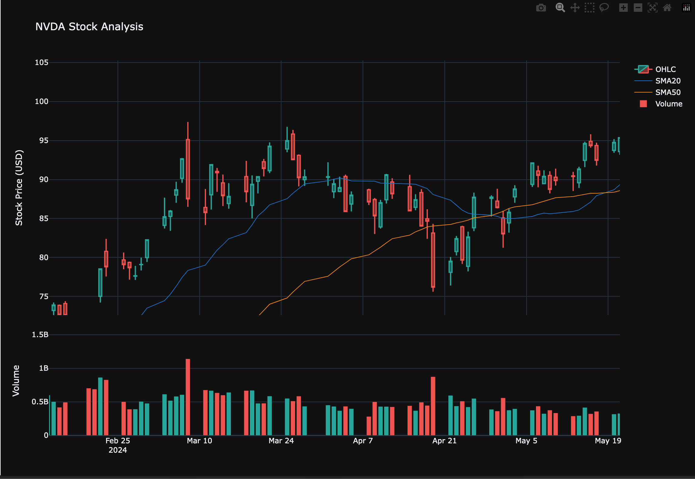
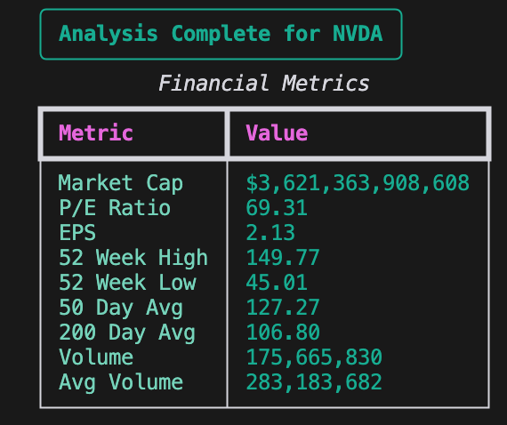

# StockPredict 📈

StockPredict is a command-line utility written in Python that analyzes stocks and predicts future price movements using AI.

## Key Features
- Historical price analysis with interactive candlestick charts
- Technical indicators (SMA20, SMA50, RSI)
- Financial metrics and market data
- AI-powered 30-day price predictions
- Progress tracking with visual feedback
- User-friendly command-line interface

## Commands
- `analyze`: Get detailed analysis and prediction for a stock
- `help`: Shows the welcome message and available commands
- `exit`: Exits the application

## Example Analysis
Here are some example screenshots of the tool in action:

### Stock Analysis Chart

*Interactive candlestick chart showing price history, SMAs, and volume*

### Financial Metrics

*Detailed financial metrics and market data*

### Price Prediction

*AI-generated 30-day price prediction with confidence intervals*

## Technical Details
- Uses yfinance API for real-time stock data
- Prophet model for time series forecasting
- Interactive candlestick charts with Plotly
- Real-time progress updates during analysis
- Clear error handling and status messages
- Financial metrics include:
  - Market Cap
  - P/E Ratio
  - EPS
  - 52 Week High/Low
  - Moving Averages
  - Volume Statistics

The application combines technical analysis with machine learning to provide insights into stock market trends. The interface offers clear visual feedback throughout the analysis process and presents predictions in an easy-to-understand format.

